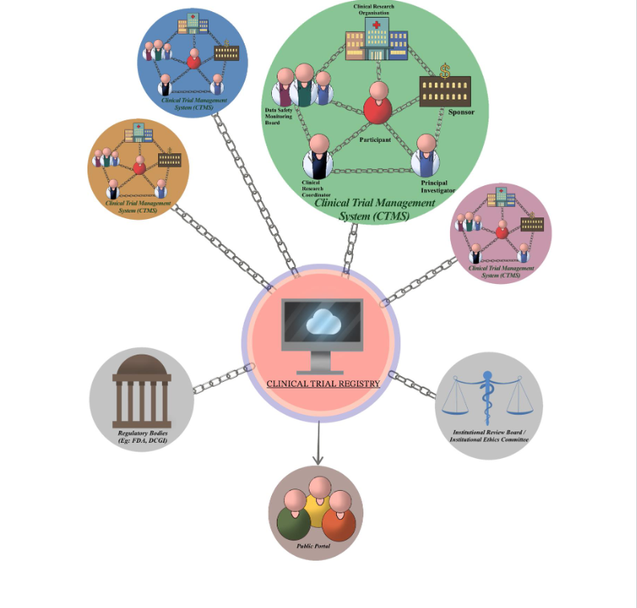
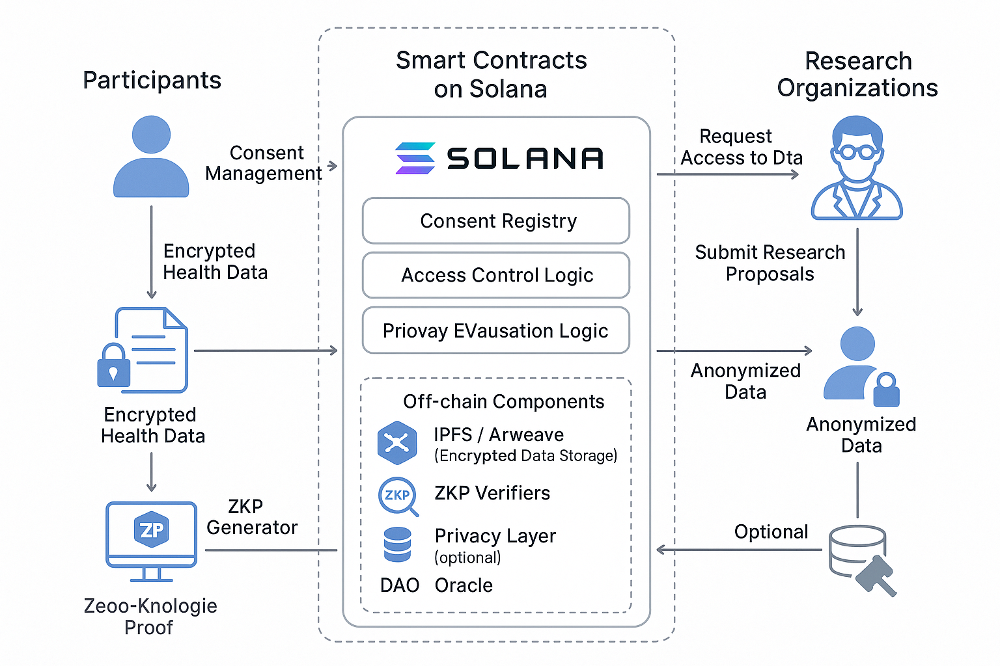

# Decentralised Clinical Research Framework 

**Key Components:**

- **Blockchain Infrastructure:** Solana now supports advanced privacy features such as Confidential Balances, which use zero-knowledge proofs (ZKPs) and homomorphic encryption to shield sensitive data (like token transfers or patient information) while maintaining regulatory compliance and auditability.
- **Federated Learning Integration:** Clinical research frameworks can leverage federated learning, allowing institutions to collaboratively train AI models without sharing raw patient data. Only encrypted model updates are posted to the blockchain, preserving privacy and adhering to regulations like GDPR.
- **Zero-Knowledge Proofs (ZKPs):** zk-SNARKs enable verification of computations or model updates on-chain without revealing underlying sensitive data, ensuring both privacy and data integrity.
- **Decentralized Access Control:** Solana’s privacy tools and protocols like Arcium and Lit enable fine-grained, programmable access controls and encrypted computation, so only authorized parties can access or process clinical data.

**Summary Table**

| Feature                        | Solana Implementation                        | Benefit for Clinical Research      |
|-------------------------------|----------------------------------------------|-----------------------------------|
| Confidential Balances          | ZKPs + Homomorphic Encryption                | Private, compliant data sharing   |
| Federated Learning             | Decentralized model training, blockchain logs| No raw data leaves institution    |
| zk-SNARKs                      | On-chain proof of computation                | Verifiable, privacy-preserving    |
| Decentralized Access Control   | Protocols like Lit, Arcium                   | Secure, granular data permissions |

This combination allows for privacy-preserving, decentralized clinical research on Solana, enabling secure collaboration between healthcare institutions without compromising patient confidentiality or regulatory compliance

## 🎯 **Benefits**

| Benefit                   | Explanation                                                              |
| ------------------------- | ------------------------------------------------------------------------ |
| **Privacy-preserving**    | Raw data never exposed; only proofs are shared                           |
| **Verifiable science**    | Prevents p-hacking or data tampering                                     |
| **Scalable AI**           | Agents automate workflows while ensuring compliance                      |
| **Decentralized trust**   | Blockchain ensures that no single party controls the process             |
| **Regulatory compliance** | Designed with GDPR, HIPAA in mind (e.g., consent tracking, pseudonymity) |

---
**Existing Frameworks**

There are privacy-preserving decentralized clinical research frameworks, primarily leveraging blockchain technology. Most existing solutions use private or consortium blockchains (like Hyperledger Fabric or Ethereum) to manage clinical trial data, automate consent, and control access via smart contracts[1][5][6]. These frameworks focus on data security, transparency, and auditability, often storing sensitive data off-chain or encrypted, and using decentralized storage systems like IPFS[1][6]. While many are still proof-of-concept or pilot projects, they demonstrate the feasibility of privacy-preserving, decentralized clinical research management[1][6][7].

Citations:
[1] https://www.medrxiv.org/content/10.1101/2024.06.12.24308813v1.full-text
[2] https://www.sciencedirect.com/science/article/pii/S1551714424002672
[3] https://pmc.ncbi.nlm.nih.gov/articles/PMC7153067/
[4] https://www.tandfonline.com/doi/full/10.1080/17576180.2025.2452774?src=exp-la
[5] https://ijtech.eng.ui.ac.id/article/view/6703
[6] https://pmc.ncbi.nlm.nih.gov/articles/PMC8075489/
[7] https://ietresearch.onlinelibrary.wiley.com/doi/10.1049/cmu2.12488
[8] https://rymedi.com/transforming-clinical-trials-with-blockchain-technology-innovations-and-challenges-in-2024/

[source: https://www.medrxiv.org/content/10.1101/2024.06.12.24308813v1.full.pdf]

[source: https://www.medrxiv.org/content/10.1101/2024.06.12.24308813v1.full.pdf]

+-----------------------------------------------------------------------------------+
|                        Privacy-Preserving Decentralized Clinical Research         |
|                                   (Solana-based)                                  |
+-----------------------------------------------------------------------------------+
|                                                                                   |
|   +-------------------+         +-------------------+         +----------------+  |
|   |  Hospital/Clinic  |         |  Research Center  |         |  Data Partner  |  |
|   +-------------------+         +-------------------+         +----------------+  |
|            |                           |                              |           |
|            |   (Local Data Storage)    |   (Local Data Storage)       |           |
|            +-----------+---------------+--------------+---------------+           |
|                        |                              |                           |
|                        v                              v                           |
|           +---------------------------------------------------------+             |
|           |    Federated Learning Clients (Local Model Training)    |             |
|           +---------------------------------------------------------+             |
|                        |                              |                           |
|                        v                              v                           |
|           +---------------------------------------------------------+             |
|           |    Model Updates (Encrypted, ZK-Proof Attached)         |             |
|           +---------------------------------------------------------+             |
|                        |                              |                           |
|                        v                              v                           |
|   +---------------------------------------------------------------------------+   |
|   |                 Solana Blockchain (Smart Contracts Layer)                 |   |
|   |  - Stores encrypted model updates                                         |   |
|   |  - Verifies ZK-proofs for privacy/compliance                              |   |
|   |  - Implements access control (Lit Protocol, Arcium, etc.)                 |   |
|   +---------------------------------------------------------------------------+   |
|                        |                              |                           |
|                        v                              v                           |
|   +---------------------------------------------------------------------------+   |
|   |        Authorized Researchers/Regulators (View/Access Encrypted Data)      |   |
|   +---------------------------------------------------------------------------+   |
|                                                                                   |
+-----------------------------------------------------------------------------------+

+---------------------------------------------------------------------------+
[ Hospital/Clinic ]        [ Research Center ]         [ Data Partner ]
        |                         |                          |
        | (Local Data Storage)    | (Local Data Storage)     |
        +-----------+-------------+-------------+------------+
                    |                           |
                    v                           v
    [ Federated Learning Clients (Local Model Training) ]
                    |                           |
                    v                           v
    [ Model Updates (Encrypted, ZK-Proof Attached) ]
                    |
                    v
[ Solana Blockchain (Smart Contracts, Access Control, ZK Verification) ]
                    |
                    v
[ Authorized Researchers/Regulators (Access Encrypted/Aggregated Results) ]
+---------------------------------------------------------------------------+

Smart contract methods

Patient Smart Contract

    addPatient: Registers a patient for the study and sets access permissions

    editPermissions: Changes a patient’s access permissions

    getPeople: Gets the set of patients registered for the study

Researcher Smart Contract

    addQuery: Submits a new query to the blockchain

    addQueryResult: Places a hash of a query result on the blockchain

    getQueries: Retrieves waiting queries from the blockchain

    getUnsolvedCount: Retrieves the number of waiting queries from the blockchain

Data Set sources: https://ncri1.partners.org/ProACT/

The key repos for development of agents and blockchain is 

https://github.com/LeoYML/clinical-agent

https://github.com/ictashik/BlockChain_ClinicalTrial

